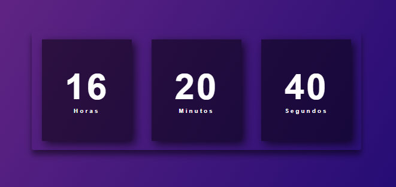

Créditos ao [video de Larissa Kich](https://youtu.be/GK0ok3ZCXwM) onde ensina a desenvolver um relógio digital utilizando JavaScript. [Link do repositório original aqui!](https://github.com/Larissakich/relogiodigital)

Este projeto foi feito com o intuito de aprendizagem sobre JavaScript. Se trada de uma aplicação simples, onde se tem o foco na utilização das instâncias de Date.

